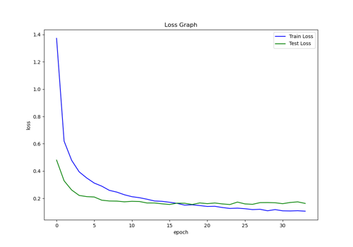

# <div align="center">Character Classification</div>


---

## [Content]
1. [Description](#description)   
2. [Installation](#installation)  
3. [Model Training](#model-training)
4. [Model Testing](#model-testing)

---
## [Description]

This project is a deep learning-based character classification model that recognizes 80 different types of characters using convolutional neural networks (CNNs). The model is trained on a dataset of characters and can predict the class of a given character image with high accuracy.


## [Installation]
1.Clone the Repository
```python
git clone https://github.com/Infinity027/Text_classification.git
cd Text_classification
```
2. Install Dependencies
```python
pip install -r requirements.txt
```

## [Model Training]
To train the model on your dataset, run:
```python
python3 train.py --data_dir "data" --batch_size 32 --epoch 100
```

Model Performance:
1. Training data Accuracy: 96.43%
2. Testing data Accuracy: 96%



## [Model Testing]
To test the model run the test model, it will generate confusion matrix of testing data:
```python
python3 testpy --test_dir "data/test" --batch_size 32 --model_path 'Modelv0_1.pth'
```

